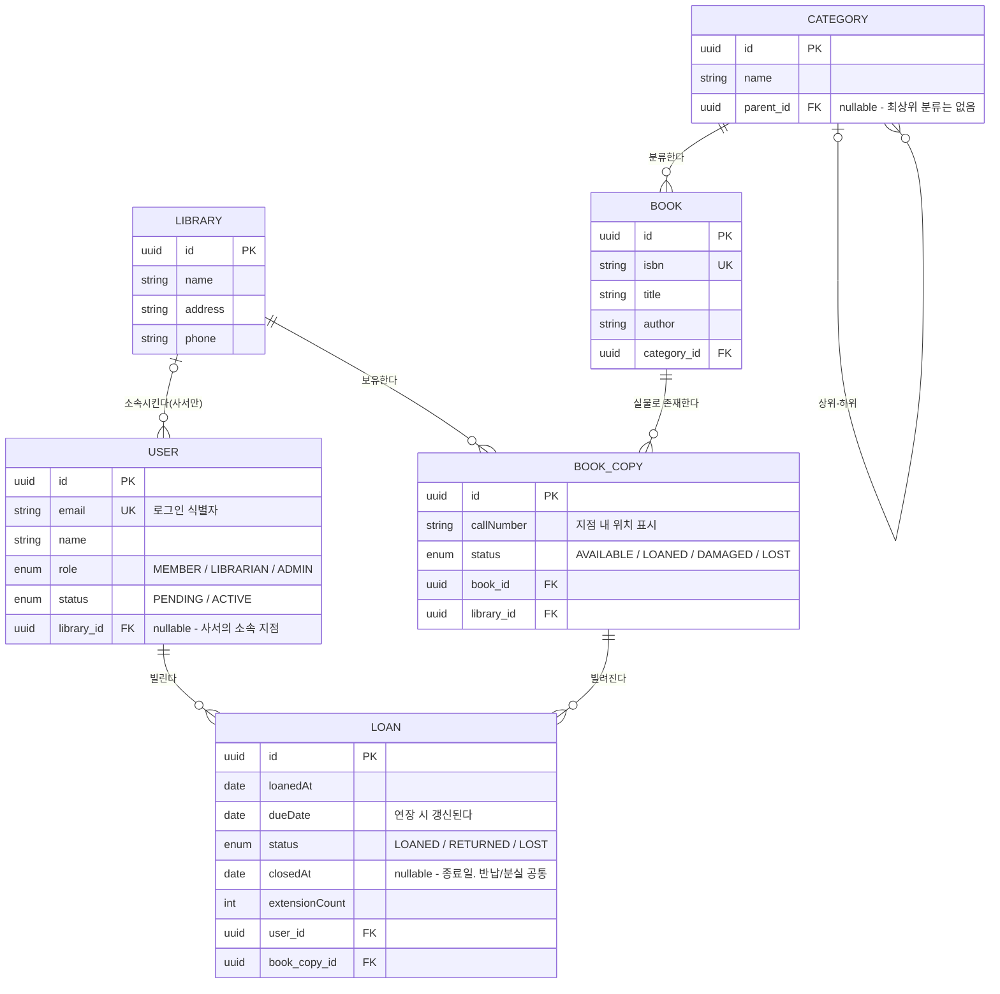
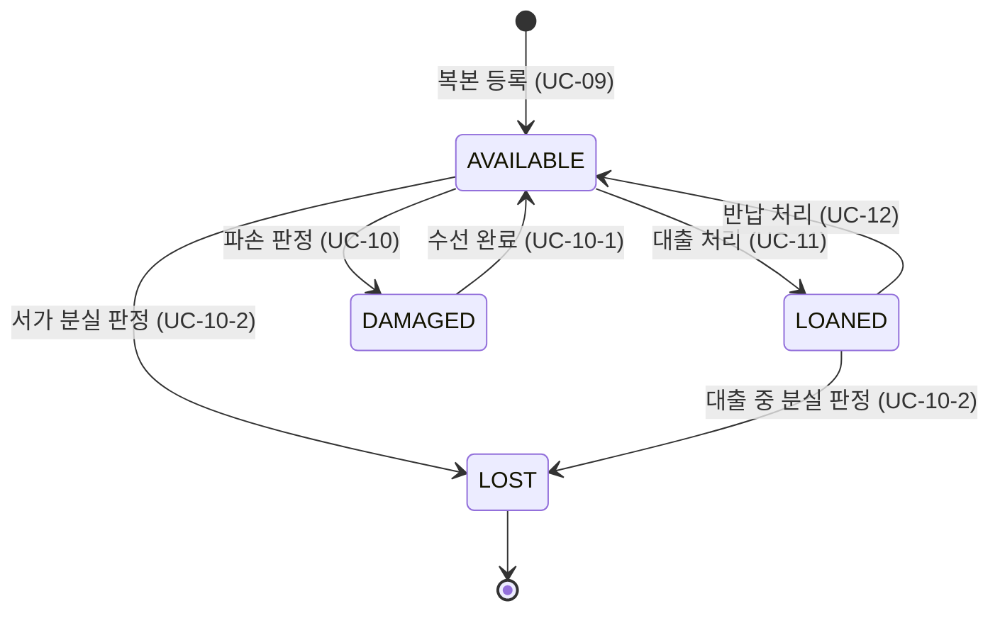
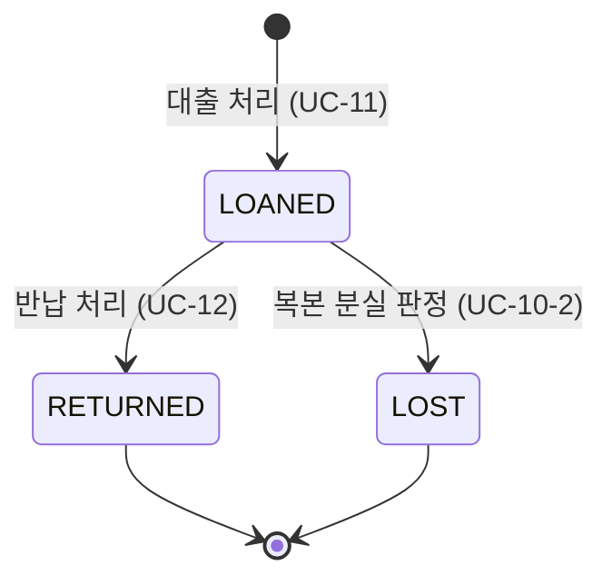
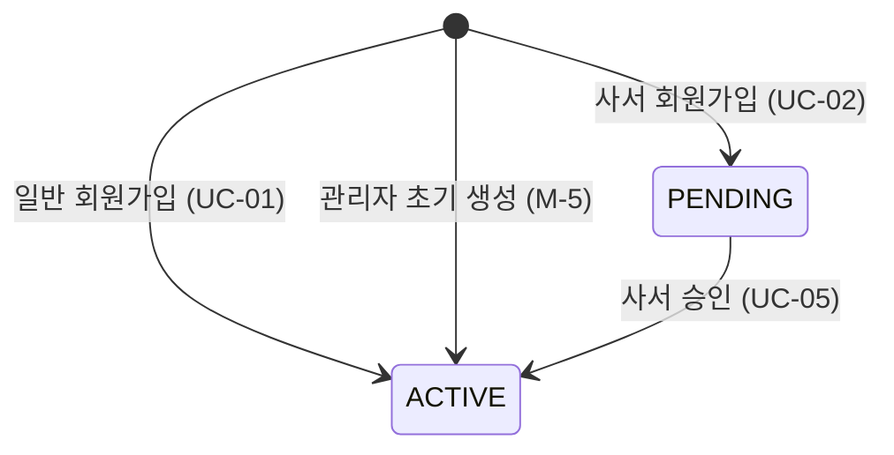

# 01. 도메인 모델

> 이 문서는 bookhub의 **개념이 어떻게 구성되어 있는가**를 다룬다.
> "무엇을 해야 하는가"는 [02-requirements.md](./02-requirements.md)가, 기술 스택과 작성 규칙은 [CONTEXT.md](./CONTEXT.md)가 담는다.
>
> **도메인 규칙의 단일 출처는 [02-requirements.md](./02-requirements.md)다.** 이 문서는 규칙을 다시 서술하지 않고 번호(L-1, P-8, B-3 …)로 참조한다.

---

## 1. 도메인 용어 사전

| 용어 | 엔티티 | 정의 |
|------|--------|------|
| **서지정보** | `Book` | 책이라는 **저작물 한 종**. ISBN으로 식별되는 카탈로그 단위이며 물리적 실체가 없다. |
| **복본** | `BookCopy` | 서가에 꽂힌 **실물 한 권**. 청구기호로 식별되고 특정 지점에 놓여 있다. 대출의 대상은 언제나 복본이다. |
| **지점** | `Library` | 물리적 도서관 건물 하나. 복본이 놓이는 장소이자 사서가 소속되는 조직 단위. |
| **분류** | `Category` | 서지정보를 묶는 주제 체계. 상위 분류를 가질 수 있어 계층을 이룬다. |
| **이용자** | `User` | 시스템 계정. 역할(MEMBER / LIBRARIAN / ADMIN)에 따라 할 수 있는 일이 다르다. |
| **대출** | `Loan` | 한 이용자가 한 복본을 빌려 갔다가 돌려주기까지의 **사건 하나**. |
| **청구기호** | `BookCopy.callNumber` | 서가에서 실물을 찾기 위한 위치 표시. 같은 책이라도 복본마다 다르다. |
| **소속 지점** | `User.library` | 사서가 업무를 수행하는 지점. 권한 판정의 두 번째 축이다 (→ P-8). |

### 오해하기 쉬운 세 가지

#### Book과 BookCopy는 "원본과 사본"이 아니다

`BookCopy`의 *copy*는 복사물이 아니라 **부(部)** 를 뜻한다. 서점에서 "이 책 3부 주세요"라고 할 때의 그 부다.

같은 책을 5권 들여놓으면 **`Book` 1개에 `BookCopy` 5개**가 생긴다. 이 5개 사이에 원본과 사본의 구분은 없다. 전부 동등한 실물이며, 각자 다른 청구기호를 갖고 서로 다른 지점에 흩어져 있을 수 있고, 어떤 것은 대출 중이고 어떤 것은 파손 상태일 수 있다.

이 구분이 없으면 **"3권 중 2권 대출 중"** 이라는 가장 기본적인 상태를 표현할 수 없다. 도서관 도메인의 출발점이 여기다.

#### 대출 대상은 Book이 아니라 BookCopy다

이용자는 "해리 포터를 빌린다"고 말하지만, 시스템이 기록하는 것은 **"청구기호 813.6-J.K-3번 실물을 빌렸다"** 이다. 반납 시 어떤 실물이 돌아왔는지, 그 실물이 파손되었는지를 판정하려면 권 단위 식별이 필요하다.

검색은 `Book` 단위로 결과를 주지만(UC-06), 대출 처리는 `BookCopy` 단위로 일어난다(UC-11). 이 비대칭이 [6장](#6-조회-관점의-구조적-특징)에서 다루는 조회 난점의 뿌리다.

#### Loan은 사건이고, 연장은 새 행이 아니다

`Loan` 한 행은 **대출부터 종료까지의 한 사건 전체**를 담는다. 빌릴 때 행이 생기고, 반납하거나 복본이 분실되면 그 행이 종료 상태가 된다(→ L-12). 중간에 행이 늘어나지 않는다.

**연장은 새 `Loan`을 만들지 않는다.** 기존 행의 `dueDate`를 미루고 `extensionCount`를 1 올릴 뿐이다(→ L-4). "2주 빌리고 1주 연장했다"는 두 건의 대출이 아니라 반납 예정일이 한 번 바뀐 한 건의 대출이다.

그래서 `Loan`을 세면 "몇 번 빌려 갔는가"가 나오고, `extensionCount`를 보면 "그 중 얼마나 붙들고 있었는가"가 나온다. 연장을 새 행으로 만들었다면 이 두 질문이 구분되지 않는다.

---

## 2. 도메인 경계

네 도메인으로 나눈다. 경계는 "무엇을 책임지는가"가 아니라 **"어느 개념이 없으면 이 도메인이 성립하지 않는가"** 로 그었다.

| 도메인 | 엔티티 | 책임 |
|--------|--------|------|
| **user** | `User` | 계정의 신원, 인증 자격, 역할과 상태. "누가 시스템을 쓰는가". 역할은 누적이 아니라 분기한다 (→ P-1) |
| **book** | `Book`, `Category` | 저작물 카탈로그와 그 분류 체계. "어떤 책이 존재하는가" |
| **library** | `Library`, `BookCopy` | 물리적 장소와 그곳에 놓인 실물. "그 책이 어디에 몇 권 있는가" |
| **loan** | `Loan` | 이용자와 실물을 잇는 사건. "누가 무엇을 언제까지 빌렸는가" |

### Category가 book에 속한 이유

`Category`는 **스스로 서는 개념이 아니다.** "문학"이라는 분류는 분류할 책이 없으면 존재 이유가 없다. 카테고리를 조회하는 유일한 목적도 책을 찾기 위해서다(UC-06 필터, → C-1).

별도 도메인으로 뽑으면 `book`이 `category`에 의존하는 단방향 관계 하나만 남는데, 이는 도메인 경계가 아니라 그냥 분리 비용이다. 분류 체계가 책과 무관한 독립 자산이 되는 날(예: 전시·행사에도 같은 분류를 쓰는 경우) 다시 검토할 일이다.

### BookCopy가 library에 속한 이유

실물은 **장소 없이 존재할 수 없다.** 복본은 반드시 어느 지점 서가에 놓여 있고, 청구기호는 그 지점 안에서의 위치 표시다.

더 결정적인 것은 **상태 변경이 지점의 행위**라는 점이다. 파손 판정, 수선 완료, 분실 판정은 모두 그 서가를 관리하는 사서가 실물을 보고 내리는 결정이다(UC-10 / UC-10-1 / UC-10-2). 권한도 소속 지점으로 제한된다(→ P-8).

`BookCopy`를 `book`에 두면 카탈로그 도메인이 물리적 상태 기계를 떠안게 된다. `Book`은 실물을 모른 채로 "어떤 책이 존재하는가"만 답해야 한다 — 그래서 도서 등록은 소속과 무관하고, 소속 제약은 `BookCopy`부터 걸린다(→ P-9).

### Loan이 별도 도메인인 이유

`Loan`은 `User`와 `BookCopy`를 잇지만 **어느 쪽에도 종속되지 않는다.**

- `user`에 두면: 대출은 이용자의 속성이 아니다. 이용자가 탈퇴해도 그 대출 이력은 장서 회전 기록으로 남아야 한다.
- `library`에 두면: 대출은 복본의 속성이 아니다. 복본은 대출되지 않은 채로도 온전한 개념이다.

무엇보다 `Loan`은 **자기 생명주기와 자기 규칙을 가진다.** 기간(L-1), 한도(L-2), 연체 판정(L-9), 연장 제약(L-4, L-5), 종료 사유(L-12)는 전부 `User`의 것도 `BookCopy`의 것도 아닌 대출 자신의 규칙이다. 생명주기와 규칙을 가진 연결은 연결선이 아니라 독립 개념이다.

---

## 3. 엔티티 관계

모든 엔티티는 `BaseEntity`를 상속해 `id`(UUID), `createdAt`, `updatedAt`을 갖는다. 다이어그램에는 관계 이해에 필요한 필드만 실었다.

### 관계 설명

| 관계 | 카디널리티 | 의미 |
|------|-----------|------|
| `BOOK` → `BOOK_COPY` | 1 : 0..N | 서지정보 하나에 실물 여러 권. 등록만 하고 실물이 아직 없을 수 있다(UC-08). |
| `LIBRARY` → `BOOK_COPY` | 1 : 0..N | 실물은 반드시 한 지점에 놓인다. 지점 간 이동은 1차 범위 밖. |
| `CATEGORY` → `BOOK` | 1 : 0..N | 책은 반드시 분류를 갖는다. 분류가 빈 채로 등록될 수 없다. |
| `USER` → `LOAN` | 1 : 0..N | 동시 진행 건수는 L-2가 제한하지만, 종료된 이력은 무제한 누적된다. |
| `BOOK_COPY` → `LOAN` | 1 : 0..N | 한 복본의 대출 이력 전체. 동시에 진행 중인 것은 최대 1건(→ [I-2](#5-주요-불변식)). |

### nullable 관계가 nullable인 이유

#### `User.library` — 역할에 따라 소속이 없다

MEMBER와 ADMIN은 소속 지점이 없고, LIBRARIAN은 반드시 있다(→ M-6). 세 역할이 한 테이블을 공유하므로 컬럼 자체는 nullable일 수밖에 없다.

여기서 중요한 것은 **"nullable = 선택적"이 아니라는 점**이다. 이 컬럼의 필수 여부는 `role` 값에 달려 있다. 스키마가 강제할 수 없는 조건이므로 불변식으로 지킨다(→ [I-3](#5-주요-불변식), [I-4](#5-주요-불변식)).

ADMIN이 소속을 갖지 않는 이유는 지점 단위 업무를 수행하지 않기 때문이다(→ P-1, P-4). 소속은 창구 업무의 범위를 정하는 값인데, ADMIN의 업무(사서 승인, 지점 개설, 지점명 수정, 카테고리 관리)는 어느 지점에도 귀속되지 않는다.

#### `Category.parent` — 최상위 분류는 부모가 없다

계층의 뿌리를 표현하는 자기참조의 종착점이다. `parent`가 없는 카테고리가 트리의 루트이며, 루트는 여러 개일 수 있다(문학 / 과학 / 역사 …).

이 nullable은 계층 탐색의 **종료 조건**이기도 하다. `parent`를 거슬러 올라가다 `null`을 만나면 멈춘다. 이 종료가 보장되려면 순환이 없어야 한다(→ C-2, [I-5](#5-주요-불변식)).

#### `Loan.closedAt` — 종료 전에는 값이 존재할 수 없다

대출이 진행 중이면 종료는 아직 일어나지 않은 사건이다. `null`은 "모름"이 아니라 **"아직 없음"** 을 뜻한다.

`status`와 짝을 이룬다. `LOANED`면 `null`, 종료되면 값이 있다(→ [I-7](#5-주요-불변식)).

**필드 이름이 `returnedAt`이 아니라 `closedAt`인 이유**는 대출의 종료 사유가 둘이기 때문이다(→ L-12). 반납으로 끝나면 실제 반납일이 곧 종료일이고, 복본 분실로 끝나면(→ B-5) 분실 판정일이 종료일이다. 이름을 `returnedAt`으로 두면 분실 종료 건에 값을 넣을 수 없어 **`LOST` 대출만 종료 시점이 기록되지 않는 공백**이 생긴다.

종료 사유 자체는 `status`가 말한다. `closedAt`은 "언제 끝났는가"만 담고 "왜 끝났는가"는 담지 않는다 — 두 질문을 한 필드에 섞지 않는다.

`dueDate`(예정일)와 헷갈리지 말 것. `dueDate`는 대출 시점에 정해지고 연장으로 갱신되는 **약속**이고, `closedAt`은 실제로 일어난 **사실**이다. 연체 판정은 이 둘이 아니라 `dueDate`와 오늘 날짜를 비교한다(→ L-9).

---

## 4. 상태 전이

### BookCopy.status

허용 전이는 이 여섯 개뿐이다(→ B-1). 특히 **`LOANED`에서 `DAMAGED`로 가는 경로가 없다** — 파손된 책은 실물이 돌아오므로 반납이 선행 가능하기 때문이다(→ B-4).

`DAMAGED`는 수선으로 되돌아올 수 있고(→ B-2), `LOST`는 최종 상태다(→ B-3). 레코드를 삭제하지는 않으므로 `LOST` 복본도 과거 대출 이력의 참조 대상으로 남는다.

### Loan.status

종료 사유는 두 가지다(→ L-12). `LOST`는 복본 분실의 연쇄 결과이며, 복본만 `LOST`로 바꾸고 대출을 방치하면 회원의 대출 한도가 영구히 묶인다(→ B-5).

#### 연체는 왜 상태가 아닌가

이 다이어그램에 `OVERDUE`가 없는 것은 누락이 아니라 결정이다.

`LOANED`와 `RETURNED`, `LOST`는 **누군가의 행위로 전이된다.** 사서가 대출을 처리하고, 반납을 받고, 분실을 판정한다. 화살표마다 원인이 되는 유스케이스가 있다.

연체는 다르다. **아무도 아무것도 하지 않아도 시간이 지나면 저절로 성립한다.** 화살표를 그릴 원인이 없다. 그래서 `dueDate`와 오늘 날짜의 비교로 판정하고 저장하지 않는다(→ L-9, [ADR-0007](./adr/0007-overdue-as-calculation.md)).

반면 분실은 사서의 명시적 판정을 거치므로 상태로 저장한다. 같은 "비정상 종료"처럼 보이지만 성질이 정반대다.

### User.status

**`PENDING`으로 진입하는 경로는 사서 가입(UC-02) 하나뿐이다.** MEMBER는 가입 즉시 `ACTIVE`이고(→ M-1), ADMIN은 초기 SQL로 `ACTIVE` 상태로 생성된다(→ M-5). 따라서 `PENDING` 계정을 만나면 그것은 반드시 승인 대기 중인 사서다(→ M-8).

이 사실이 중요한 이유는 `status`를 검사하는 지점에서 그 검사가 실제로 무엇을 걸러내는지가 달라 보이기 때문이다. 로그인 차단(→ M-3)과 대출 대상 검증(→ L-13)은 둘 다 `ACTIVE`를 요구하지만, 실제로 막히는 대상은 양쪽 모두 "승인 전 사서"뿐이다. 일반 회원이 이 검사에 걸리는 경우는 없다.

되돌아가는 전이가 없다. 계정 정지·탈퇴는 1차 범위 밖이므로 `ACTIVE`가 사실상 종착점이다.

---

## 5. 주요 불변식

시스템이 어떤 시점에 관찰되더라도 참이어야 하는 조건이다. 스키마만으로는 강제되지 않아 애플리케이션이 지켜야 한다.

| # | 불변식 | 깨지면 |
|---|--------|--------|
| **I-1** | `status`가 `LOANED`인 `Loan`이 있는 `BookCopy`는 반드시 `status`가 `LOANED`다. | 빌려 간 책이 서가에 있는 것으로 표시되어 같은 실물이 두 번 대출된다. |
| **I-2** | 한 `BookCopy`에 대해 `status`가 `LOANED`인 `Loan`은 최대 1건이다. | 한 권을 두 사람이 동시에 빌린 기록이 생겨 어느 쪽이 반납해야 하는지 판정할 수 없다. |
| **I-3** | `role`이 `LIBRARIAN`인 `User`는 `library`가 `null`이 아니다. | 소속이 없는 사서가 생겨 P-8의 지점 비교 대상이 사라진다 — 전 지점 권한과 구별되지 않는다. |
| **I-4** | `role`이 `MEMBER` 또는 `ADMIN`인 `User`는 `library`가 `null`이다. | `library`는 P-8이 검사할 지점 범위를 담는 값이다. ADMIN에 소속이 붙으면 수행하지도 않는 창구 업무에 범위가 생기고, "소속이 있으면 지점 업무 담당자"라는 판정이 깨져 P-8 검사가 ADMIN 요청을 통과시킬 수 있다. |
| **I-5** | `Category`의 `parent`를 거슬러 올라가면 반드시 루트(`parent`가 `null`)에 도달한다. | 계층 탐색이 무한 재귀에 빠진다. 하위 포함 검색(C-1)이 응답하지 않는다. |
| **I-6** | `BookCopy`가 `LOST`로 전환될 때 그 복본의 진행 중이던 `Loan`도 `LOST`다. | 회원의 대출 한도가 영구히 점유되고, 기한이 지나면 연체로 신규 대출까지 막힌다 (→ B-5). |
| **I-7** | `Loan.closedAt`은 `status`가 `RETURNED` 또는 `LOST`일 때만 값을 갖는다. 거꾸로 두 상태에서는 반드시 값이 있다. | 진행 중인 대출에 종료일이 붙으면 장서 회전율이 오염되고, 종료된 대출에 종료일이 없으면 분실 건이 통계에서 시점 없이 떠돈다. |
| **I-8** | `status`가 `DAMAGED` 또는 `LOST`인 `BookCopy`에는 진행 중인 `Loan`이 없다. | 대출 불가한 책이 대출 중으로 남아 반납도 재대출도 불가능한 교착 상태가 된다. |

I-6 ~ I-8은 앞의 다섯 항목에서 파생된다. I-1과 I-8은 같은 정합성의 양면이고(복본 상태 ↔ 대출 상태), I-6은 B-5가 지켜질 때만 성립한다.

I-3과 I-4는 `User.library`가 nullable이면서도 "선택적"이 아니기 때문에 필요하다. 스키마는 `null` 허용 여부만 말할 수 있고 "역할에 따라 다르다"는 표현할 수 없다.

---

## 6. 조회 관점의 구조적 특징

모델이 개념을 정확히 나눈 대가로, 몇몇 조회는 구조를 거슬러 올라가야 한다. 여기서는 **왜 까다로운지**만 짚는다.

### 조회 대상과 조건이 다른 엔티티에 있다

UC-06의 "대출 가능한 복본이 있는 Book" 필터가 전형이다.

**결과는 `Book` 단위**로 나와야 한다. 이용자는 "해리 포터"를 찾지 "813.6-J.K-3번 실물"을 찾지 않는다. 그런데 **조건은 `BookCopy`에 걸린다** — 대출 가능 여부는 복본의 `status`이기 때문이다.

게다가 이 조건은 **존재 판정**이다. 모든 복본이 대출 가능해야 하는 게 아니라 **한 권이라도** 있으면 된다. 지점 필터까지 겹치면 "이 지점에 있는 복본 중 `AVAILABLE`인 것이 하나 이상인 Book"이 된다.

한 `Book`에 여러 `BookCopy`가 달리므로 단순 조인은 같은 책을 복본 수만큼 중복 반환한다. 결과 단위와 조건 단위가 다르다는 것이 이 조회의 본질이다.

### 계층을 펼쳐야 비교할 수 있다

C-1에 따라 "문학"으로 검색하면 "한국소설"의 책도 나와야 한다.

`Category.parent`는 **바로 위 한 칸**만 가리킨다. "문학의 모든 자손"을 알려면 깊이를 모르는 채로 계층을 끝까지 내려가야 하고, 그 다음에야 `Book`의 분류가 그 집합에 속하는지 비교할 수 있다.

조건 하나를 평가하기 위해 먼저 **집합을 만들어야 한다**는 점이 다른 필터(제목, ISBN)와 다르다. 트리 깊이가 얕아 실질 부담은 작지만, 구조적으로는 한 단계가 더 있다.

I-5가 보장되지 않으면 이 펼치기는 끝나지 않는다.

### 필요한 정보가 한 칸 떨어져 있다

UC-16은 사서 소속 지점의 대출 현황을 조회한다. 그런데 **`Loan`은 지점을 모른다.**

대출은 이용자와 복본을 잇는 사건이고, 지점 정보는 복본이 갖고 있다. 대출 시점에 `Loan`에 지점을 복사해 두지 않았기 때문에 매번 `BookCopy`를 거쳐야 한다.

이것은 모델링 실수가 아니라 선택이다. `Loan`에 지점을 중복 저장하면 복본이 옮겨질 때 두 값이 어긋난다 — L-9에서 연체를 저장하지 않기로 한 것과 같은 판단이다(진실은 하나여야 한다). 지점 간 이동이 1차 범위 밖이라 당장은 어긋날 일이 없지만, 그 기능이 들어오는 순간 문제가 되는 쪽은 중복 저장이다.

지점 대출 현황에서 연체 건을 함께 보려면 여기에 연체 계산(L-9)까지 겹친다. 저장된 상태가 아니라 `dueDate` 비교이므로, 지점 필터와 연체 조건이 서로 다른 엔티티에서 평가된다.

#### 이 조회가 성립하는 전제

`BookCopy`를 거쳐 지점을 알아내는 방식이 옳은 답을 주는 것은 **"대출이 일어난 지점 == 복본이 속한 지점"이 항상 성립하기 때문**이다.

이 등식은 우연이 아니라 권한 설계의 결과다. 대출 처리(UC-11)도 분실 처리(UC-10-2)도 사서의 소속 지점으로 제한되므로(→ P-8), 어떤 대출이든 복본이 소장된 지점에서만 발생한다. 그래서 "복본의 지점"을 물으면 "대출이 일어난 지점"의 답이 나온다.

**이 전제는 지점 간 이동과 상호대차를 1차 범위에서 제외했기 때문에 성립한다.** 해당 기능이 들어오면 "빌린 지점"과 "소장 지점"이 달라질 수 있고, 그 순간 두 개념을 구분할 수단이 사라진다. 지점별 대출 실적은 어느 쪽을 세야 하는지 답이 갈리고, 복본이 다른 지점으로 옮겨지면 과거 대출의 발생 지점까지 소급해 바뀐다.

그때는 `Loan`에 대출 지점을 직접 담아야 한다. 이는 앞서 "중복 저장은 진실을 둘로 만든다"고 한 것과 모순되지 않는다 — 상호대차가 생기면 **대출 지점은 복본 지점의 사본이 아니라 독립된 사실**이 되기 때문이다. 지금 담지 않는 이유는 그 사실이 아직 복본 지점과 항상 같아서지, 중요하지 않아서가 아니다.

---

## 변경 이력

| 날짜 | 내용 |
|------|------|
| 2026-09-18 | 최초 작성. CONTEXT.md·02-requirements.md 기반, 복본/대출 상태 전이 확정(B-1~B-5, L-12) 반영. |
| 2026-09-18 | `Loan.returnedAt` → `closedAt` 개명 (분실 종료 시점 기록 공백 해소, I-7 갱신). 6장에 상호대차 전제 절 추가. |
| 2026-09-18 | User.status 설명에 M-8(PENDING은 사서 전용)·L-13 반영. 권한 분기 모델(P-1) 참조 추가. |
| 2026-09-18 | `User.library` nullable 사유와 I-4를 권한 분기 모델 기준으로 교체 (누적 모델 잔재 제거). |
